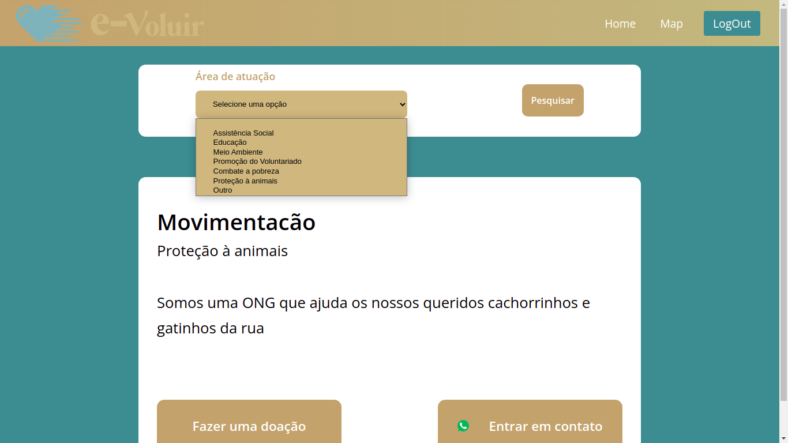
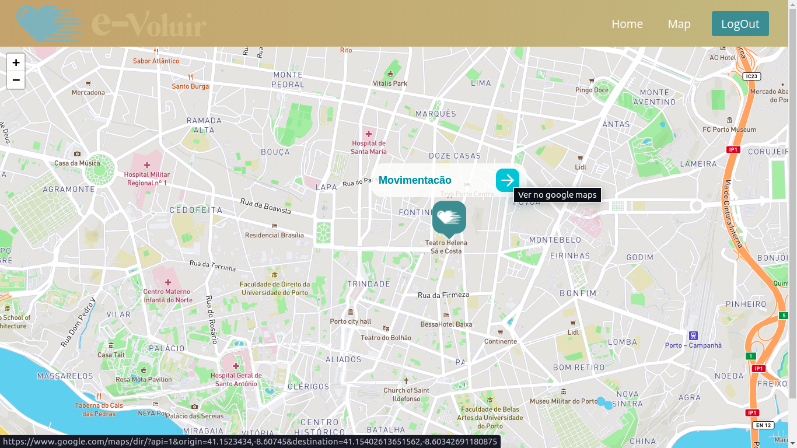

<p align="center">
	
	
  	
	<a href="https://twitter.com/gusmartins994">
		
 	</a>
</p>

<h1 align="center">
    
</h1>

<h4 align="center"> 
	🚧  E-voluir 💙 Concluído 🚀 🚧
</h4>

<p align="center">
 <a href="#-sobre-o-projeto">Sobre</a> •
 <a href="#-funcionalidades">Funcionalidades</a> •
 <a href="#-como-executar-o-projeto">Como executar</a> • 
 <a href="#-tecnologias">Tecnologias</a> • 
 <a href="#-autor">Autor</a> • 
 <a href="#user-content--licença">Licença</a>
</p>


## 💻 Sobre o projeto

💙 E-voluir - É uma plataforma digital para ONGs receberem doações através do PIX


Projeto desenvolvido para o trabalho de conclusão de curso - TCC

---

## ⚙️ Funcionalidades

- [x] Ongs podem se cadastrar na plataforma preenchendo um formulário contendo:
  - [x] Dados da organização
  - [x] Localização no mapa
  - [x] Chave PIX

- [x] Os usuários (doadores) pode se cadastrar na plataforma preenchendo um formulário:
  - [x] Nome
  - [x] E-mail
  - [X] Senha

- [X] Localização das Ong mais próximas pelo mapa:
  - [X] Rota até a organização pelo Google Maps

---

### Web

<p align="center" style="display: flex; align-items: flex-start; justify-content: center;">
  
  
  
</p>

---

## 🚀 Como executar o projeto

Este projeto é divido em duas partes:
1. Backend (pasta server) 
2. Frontend (pasta web)

### Pré-requisitos

Antes de começar, você vai precisar ter instalado em sua máquina as seguintes ferramentas:
[Git](https://git-scm.com), [Node.js](https://nodejs.org/en/). 
Além disto é bom ter um editor para trabalhar com o código como [VSCode](https://code.visualstudio.com/)

#### 🎲 Rodando o Backend (servidor)

```bash

# Clone este repositório
$ git clone https://github.com/GusMartins499/e-voluir.git
$ git clone git@github.com:GusMartins499/e-voluir.git

# Acesse a pasta do projeto no seu terminal/cmd
$ cd e-voluir

# Vá para a pasta server
$ cd server

# Instale as dependências
$ npm install
$ yarn install

# Execute a aplicação em modo de desenvolvimento
$ npm run dev
$ yarn dev

# O servidor inciará na porta:3333 - acesse http://localhost:3333 

```
[](https://insomnia.rest/run/?label=e-voluir&uri=ttps%3A%2F%2Fraw.githubusercontent.com%2FGusMartins499%2Fe-voluir%2Fmaster%2Fserver%2FInsomnia_2021-11-25.json%3Ftoken%3DAKM7UVLEBYJTHS5O7ZRZCK3BT55BA)


#### 🧭 Rodando a aplicação web (Frontend)

```bash

# Clone este repositório
$ git clone https://github.com/GusMartins499/e-voluir.git
$ git clone git@github.com:GusMartins499/e-voluir.git

# Acesse a pasta do projeto no seu terminal/cmd
$ cd e-voluir

# Vá para a pasta da aplicação Front End
$ cd web

# Instale as dependências
$ npm install
$ yarn 

# Execute a aplicação em modo de desenvolvimento
$ npm run start
$ yarn start

# A aplicação será aberta na porta:3000 - acesse http://localhost:3000

```

---

## 🛠 Tecnologias

As seguintes ferramentas foram usadas na construção do projeto:

#### **Website**  ([React](https://reactjs.org/)  +  [TypeScript](https://www.typescriptlang.org/))

-   **[React Router Dom](https://github.com/ReactTraining/react-router/tree/master/packages/react-router-dom)**
-   **[React Icons](https://react-icons.github.io/react-icons/)**
-   **[Axios](https://github.com/axios/axios)**
-   **[Leaflet](https://react-leaflet.js.org/en/)**
-   **[React Leaflet](https://react-leaflet.js.org/)**
-   **[MapBox](https://www.mapbox.com/)**

> Veja o arquivo  [package.json](https://github.com/GusMartins499/e-voluir/blob/master/web/package.json)

#### [](https://github.com/GusMartins499/e-voluir/tree/master/server)**Server**  ([NodeJS](https://nodejs.org/en/)  +  [TypeScript](https://www.typescriptlang.org/))

-   **[Express](https://expressjs.com/)**
-   **[CORS](https://expressjs.com/en/resources/middleware/cors.html)**
-   **[TypeORM](https://typeorm.io/#/)**
-   **[Postgresql](https://www.postgresql.org/)**
-   **[Docker](https://www.docker.com/)**
-   **[ts-node-dev](https://www.npmjs.com/package/ts-node-dev)**

> Veja o arquivo  [package.json](https://github.com/GusMartins499/e-voluir/blob/master/server/package.json)


---

## 📝 Licença

Este projeto esta sobe a licença [MIT](./LICENSE).
